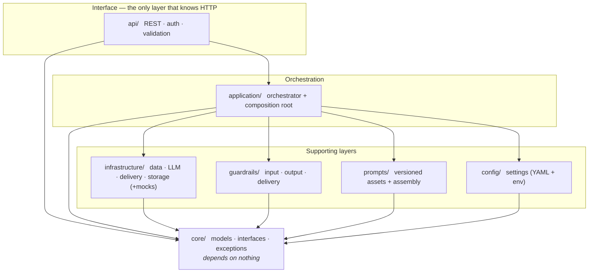

# Morning Brief — System Architecture

A guide to how this system is built and *why* it's built that way. It's written to
be read top-to-bottom as a learning resource: the patterns here — dependency
inversion, layered safety, immutable audit, controlled API contracts — are the ones
that separate a production decision-support system from a demo.

---

## 1. What the system does

Morning Brief compresses the ~60 minutes a fixed-income desk spends assembling
pre-market context into a 3-minute briefing. On a schedule it:

1. fetches market data (yields, instruments, FX),
2. validates that data,
3. asks an LLM to produce a structured analysis,
4. verifies the analysis,
5. renders and delivers it (email today; Slack/PDF/API designed-for),
6. records an immutable audit record of the whole run.

The hard part isn't step 3. It's doing 1–6 *correctly under failure*: bad data must
not reach the model, hallucinated numbers must not reach the desk, a partial outage
should degrade gracefully rather than go dark, and every run must be auditable after
the fact. The architecture exists to make those guarantees structural rather than
hopeful.

---

## 2. System overview

### 2.1 Six layers, dependencies pointing inward



*Every arrow points inward, toward `core/`.* `core/` imports nothing else in the
repo; the supporting layers depend only on `core/`; `application/` composes them; and
`api/` sits on top.

The rule that keeps it maintainable: **dependencies point inward toward `core/`.**
`core/` imports nothing else in the repo. `infrastructure/`, `guardrails/`,
`prompts/`, `config/` depend only on `core/`. `application/` composes them. `api/`
sits on top and is the only layer that knows HTTP exists. Nothing below `api/`
imports a web framework; nothing below `application/` imports a concrete data source
or SMTP client.

Why this matters: you can swap yfinance for Bloomberg, Claude for a local model, or
SMTP for Slack, by writing a new class behind an existing interface — without
touching a single line of business logic.

### 2.2 The pipeline, end to end

One run, traced through the code:

```mermaid
sequenceDiagram
    autonumber
    participant S as Scheduler / API
    participant O as BriefOrchestrator
    participant D as DataProvider
    participant G as Guardrails
    participant E as AnalysisEngine (LLM)
    participant R as Renderer + Router
    participant A as AuditStore

    S->>O: run()
    O->>D: health_check() then fetch_snapshot()
    D-->>O: MarketSnapshot (+ data-quality report)
    O->>G: input tier — yield range · completeness · staleness
    Note over O,G: CRITICAL → abort; a FAILED BriefRun is still recorded
    O->>O: build + validate versioned prompt
    O->>E: analyse(snapshot, prompt)
    E-->>O: BriefAnalysis (validated structure)
    O->>G: output tier — grounding · confidence · length
    Note over O,G: WARNING → attach to the run and continue
    O->>R: render, then delivery tier (whitelist · completeness · disclaimer)
    O->>R: deliver to channels
    R-->>O: per-recipient DeliveryResults
    O->>A: record(BriefRun)
    Note over O,A: always persisted — success, partial, or failed
```

Each step either passes, attaches a WARNING and continues, or raises a CRITICAL that
aborts to a single finalize-and-persist point. The method-level calls
(`run_input`/`run_output`/`run_delivery`, `router.deliver`, `audit_store.record`)
live in `application/orchestrator.py`.

Each step can abort (CRITICAL) or warn (WARNING). The orchestrator accumulates state
as it goes and, at the end, builds one immutable `BriefRun` and persists it — whether
the run succeeded, partially delivered, or failed.

---

## 3. Layer by layer

### 3.1 `core/` — the domain

Pure Python: models, interfaces, exceptions. No frameworks, no I/O.

- **Models** (`core/models/`) inherit `FrozenModel`: `frozen=True` (immutable —
  defends the audit trail), `strict=True` (no silent coercion), `extra="forbid"`
  (unknown fields raise). Collection fields use `tuple[T, ...]`, not `list`, so they
  can't be mutated on a frozen model. Every datetime is timezone-aware UTC, enforced
  by a validator. Key types: `MarketSnapshot`, `BriefAnalysis`, `RenderedReport`,
  `BriefRun` (the audit artifact).
- **Interfaces** (`core/interfaces/`) are abstract base classes — the contracts:
  `DataProvider`, `AnalysisEngine`, `ReportRenderer`, `DeliveryChannel`,
  `AuditStore`, and the three guardrail interfaces. High-level code depends on these,
  never on a concrete class (dependency inversion).
- **Exceptions** (`core/exceptions/`) form a hierarchy rooted at `BriefSystemError`
  (`DataFetchError`, `AnalysisError`, `GuardrailError`, `RenderError`,
  `DeliveryError`, `StorageError`, `PromptError`, `ConfigError`). Application code
  raises these specific types, never bare `Exception`/`ValueError`.

### 3.2 `config/` — settings

`Settings` (Pydantic Settings) loads, in precedence order: env vars > `.env` >
env-specific YAML > `config/default.yaml` > field defaults. Two production-shaping
choices:

- **Namespacing.** Only the top-level `Settings` is a `BaseSettings`; every nested
  group (`LLMSettings`, `DeliverySettings`, …) is a plain `BaseModel`. This is
  deliberate: a `BaseSettings` reads unprefixed env vars on its own, so nesting them
  would let a stray `NAME` or `TIMEOUT_SECONDS` in the environment silently bind into
  config. With `BaseModel`, values arrive *only* through the parent's namespaced
  `MORNING_BRIEF_<SECTION>__<FIELD>` vars.
- **Secrets** are `SecretStr`, sourced from env only, never in YAML or code.

### 3.3 `infrastructure/` — concrete implementations (+ mocks)

Each interface has a real implementation and a mock, living side by side
(`yfinance_data_provider.py` next to `mock_data_provider.py`). Tests use the mocks;
the mocks aren't an afterthought, they're how the system runs without network or
credentials. Contract tests assert a real and its mock honor the same interface.

Notables: `AnthropicAnalysisEngine` (structured output + retries via `tenacity`),
`HtmlEmailRenderer` (Jinja2), `EmailDeliveryChannel` (aiosmtplib over STARTTLS),
`JsonAuditStore` (append-only JSON files, restrictive permissions; a `MockAuditStore`
holds runs in memory).

### 3.4 `prompts/` — versioned prompt assets

Prompts are YAML files (`prompts/templates/`), not strings in code. `PromptRegistry`
loads them by name + version; `PromptBuilder` assembles system + context + schema +
examples into an `AssembledPrompt`; `PromptValidator` checks completeness and token
budget. The version used is recorded on the analysis and the audit record, so you can
roll a prompt back without redeploying and know exactly which prompt produced any
past brief.

### 3.5 `guardrails/` — three-tier safety

Each rule is a small class implementing a guardrail interface, returning a
`GuardrailResult` with a severity:

- **Input** (after fetch, before the LLM): yield range, maturity completeness,
  staleness.
- **Output** (after the LLM, before rendering): numerical grounding (decimals in the
  prose must trace to the snapshot), confidence threshold, narrative length.
- **Delivery** (after rendering, before send): recipient whitelist, report
  completeness, compliance disclaimer.

The `runner` executes a tier and aggregates a `GuardrailReport`. The severity model
is the safety policy:

- **CRITICAL** → abort the run (a FAILED `BriefRun` is still recorded).
- **WARNING** → attach to the run and continue (graceful degradation).
- **PASS** → continue.

The guardrails are pure and config-injected (thresholds, whitelist passed in) so they
stay in `core/`-only dependency territory and are trivially testable.

### 3.6 `application/` — orchestration

**`BriefOrchestrator`** runs one pipeline execution. It depends only on abstractions
(the interfaces + guardrail tuples + the runner functions), supplied by the
composition root. Two patterns worth studying:

- *Builder vs artifact.* During a run it mutates a private `_RunState` accumulator;
  at the end it constructs the immutable `BriefRun` once, when every value is known.
  The audit record is never half-built.
- *Linear flow with clean aborts.* Each step can raise an internal
  `_PipelineAbortedError` to unwind to a single finalize-and-persist point, so the
  happy path reads as a straight line. A catch-all guarantees that even an
  *undocumented* failure still records a FAILED run — "every run is auditable" is
  enforced, not hoped for.

**The composition root** (`application/composition.py`) is the *one* module allowed to
import concrete infrastructure. It reads `Settings`, selects implementations
(`yfinance`/`mock`, `anthropic`/`mock`, …), builds the guardrails from config, and
assembles a `BriefOrchestrator`. `build_application()` returns an `Application` (the
orchestrator + the audit store it shares) so the API's write and read paths use the
same store. Everywhere else sees interfaces; this is where the wiring lives.

### 3.7 `api/` — the HTTP interface

FastAPI, the only layer that knows HTTP. `create_app(settings)` is a factory that
wires dependencies through FastAPI's override seam (no globals, no `app.state`
typing holes) and is trivially testable. Endpoints: `POST /briefs/run` (trigger),
`GET /briefs/{id}` / `?on=<date>` / `/latest` (audit retrieval), `GET /health`.

The error subsystem lives in one module (`api/errors.py`): an `ApiErrorCode` enum, a
single `ErrorResponse` envelope, a typed `ApiError` hierarchy the routes raise, the
handlers, and `error_responses(*ApiError)` — which *derives* each endpoint's OpenAPI
failure docs from the exception classes (declare a status + description once). Auth is
a fail-closed `HTTPBearer` scheme with constant-time comparison.

Responses use deliberate DTOs, never raw domain models: `GET /briefs/{id}` returns a
`BriefRunResponse` that omits recipient addresses (PII) and the raw snapshot. The full
record stays in the store for privileged access.

### 3.8 `observability/` and the CLI

`observability/logging.py` configures structlog (JSON in prod, console in dev). The
CLI (`cli.py`, `morning-brief`) has `run` (one brief, exit code reflects outcome) and
`serve` (the API), configuring logging at startup. Scheduling is external — a cron /
CronJob invokes `morning-brief run` at the `schedule_cron` cadence; there's no
in-process daemon to keep alive.

---

## 4. Design decisions & patterns (the core learning)

| Decision | Why |
|---|---|
| **Dependency inversion** behind ABCs | Swap any external dependency by writing a new class; business logic and tests never change. The composition root is the only place that knows concretes exist. |
| **Composition root** | Wiring is centralized and explicit. Reading one file tells you the whole object graph. |
| **Three-tier guardrails + severity** | Safety is layered at every boundary (before LLM, after LLM, before send) with a uniform CRITICAL-aborts / WARNING-continues policy. |
| **Graceful degradation** | A partial brief with a recorded warning beats no brief with no notice. The pipeline reports its own health rather than crashing. |
| **Immutable audit, built once** | The `BriefRun` is the compliance artifact. A mutable accumulator gathers state during the run; the frozen record is constructed at the end and is append-only in storage. |
| **Response DTOs, not domain models, at the boundary** | The API contract is intentional and stable; new domain fields can't silently leak (this is how recipient PII is kept off the wire). |
| **Delivery guardrails in the orchestrator (Option A)** | With one channel today, validating one render and aggregating all three tiers in the orchestrator is simpler than threading guardrail state through the router. When a second real channel lands, move per-channel validation into the `ChannelRouter`. |
| **Config namespacing (`BaseModel` nesting)** | Only `MORNING_BRIEF_*` vars configure the app; stray environment variables can't corrupt config or crash startup. |
| **Errors as first-class data** | Failures are recorded as `BriefError` objects on the run, not just logged — they're queryable after the fact. |

### Security posture (summary; full threat model in `SECURITY.md`)
- Secrets are `SecretStr`, never logged or returned; the API carries no secrets.
- Fail-closed bearer auth, constant-time comparison.
- Input validated at the edge — `run_id` is a `UUID`, rejecting injection before it
  reaches storage (the store also escapes glob characters as defence in depth).
- Recipient PII is omitted from API responses by the DTO.
- Audit files are written with restrictive permissions; deployment provides TLS and
  ingress rate limiting.

---

## 5. Testing strategy

- **Unit** (`tests/unit/`) — one module per source module; external dependencies
  mocked; deterministic (injected clocks, no real network); fast.
- **Contract** — a real implementation and its mock are run against the same tests, so
  the mock can't drift from the real behavior the system depends on.
- **Integration** (`tests/integration/`) — the *real* internal pipeline (guardrails,
  prompt layer, renderer, router) + a real on-disk `JsonAuditStore`, mocking only the
  network edges, asserting both the outcome and the record read back from disk. Plus
  an HTTP end-to-end test through the real store.
- **The gate** (enforced in CI): `ruff` (lint + format), `mypy` strict, `pyright`
  strict, `pytest` — over `src` *and* `tests` — plus `pip-audit`. Production code is
  strict; test code relaxes only the unavoidable third-party-typing noise via a
  pyright `executionEnvironments` block, never by lowering the `src` bar.

---

## 6. Extending the system

The interfaces are the extension points. To add a capability you implement a contract
and register it in the composition root — nothing else changes.

- **New data source** → implement `DataProvider`, add a branch in
  `_build_data_provider`.
- **New delivery channel** → implement `DeliveryChannel` (+ a renderer for its
  format), add it to the router's targets. (This is also when delivery-guardrail
  validation should move into the `ChannelRouter`.)
- **New audit backend** → implement `AuditStore`, add a branch in `_build_audit_store`.
- **New API failure mode** → add an `ApiError` subclass; its status, code, and OpenAPI
  docs follow automatically via `error_responses`.

---

## 7. Running & deployment

```bash
uv run morning-brief run     # one brief, then exit (the unit a scheduler invokes)
uv run morning-brief serve   # the HTTP API; docs at /docs
```

Configuration: `config/*.yaml` + `MORNING_BRIEF_*` env (secrets via `.env`, see
`.env.example`). Scheduling, TLS, and rate limiting are deployment concerns — see
`SECURITY.md` for the controls the deployment must provide.

---

## 8. Concept → file map

| Concept | Where |
|---|---|
| Domain models | `core/models/` |
| Interfaces (contracts) | `core/interfaces/` |
| Exception hierarchy | `core/exceptions/errors.py` |
| Settings | `config/settings.py` |
| Guardrail rules + runner | `guardrails/` |
| Pipeline orchestration | `application/orchestrator.py` |
| Composition root (wiring) | `application/composition.py` |
| Channel fan-out | `application/delivery_router.py` |
| HTTP app + routes | `api/app.py`, `api/routes/` |
| API error subsystem | `api/errors.py` |
| Response DTOs | `api/schemas/responses.py` |
| Logging config | `observability/logging.py` |
| CLI / entry point | `cli.py`, `__main__.py` |
| Security threat model | `SECURITY.md` |
